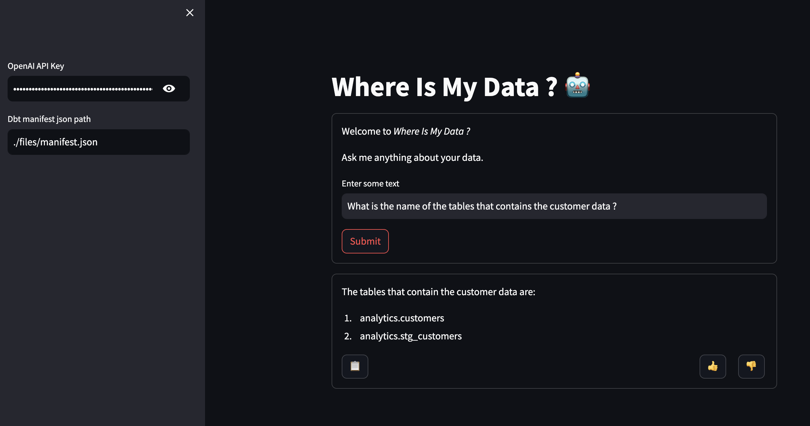

# wimda
wimda = W(here) I(s) M(y) D(data)

This application allows you ask questions about your own data.

Requirements:
* OpenAI API Key
* A manifest.json DBT project

The current dbt project example is equivalent to this project: https://github.com/meltano/jaffle-shop-template

